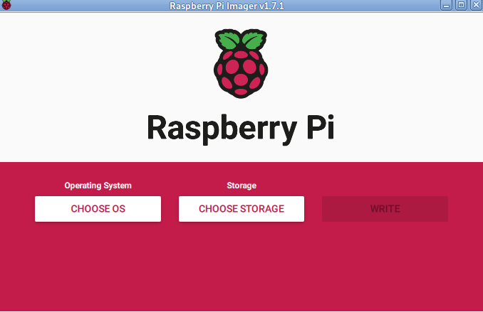

Procedimiento para instalar *Debian* "nativo" en una *Raspberry Pi*
-------------------------------------------------------------------

Lo primero que hay que hacer es descargar la imagen básica desde el enlace https://raspi.debian.net/. Hay dos posibilidades: descargar la imagen creada diariamente (https://raspi.debian.net/daily-images/) o de la versión probada (https://raspi.debian.net/tested-images/). Yo suelo utilizar las imágenes creadas diariamente y si encuentro problemas en la instalación me descargo la imagen testeada.

.. note::

    Aunque la página dice que las imágenes son creadas diariamente si observas la fecha de los ficheros verás que (posiblemente) no son muy recientes. No te preocupes cuando actualices tu sistema se configurará con los últimos paquetes de la distribución.

Una vez descargada hay que escribirla en una tarjeta *microSD*. Para ello utilizaremos, si tenemos instalado el *Raspberry Pi OS* en una *RPi 4 o 400* el programa rpi-imager_ que que está disponible en este sistema operativo o si estamos en un sistema *Debian* se puede compilar e instalar siguiendo las instrucciones que se pueden ver en https://github.com/raspberrypi/rpi-imager. También es posible bajar una *AppImage* de https://github.com/raspberrypi/rpi-imager/releases. Una vez descargada la tienes que hacer ejecutable con ``chmod +x  Raspberry_Pi_Imager-x.y.z-x86_64.AppImage`` y luego ejecutarla con ``./Raspberry_Pi_Imager-x.y.z-x86_64.AppImage``.

   
   rpi-imager. Programa para copiar una imagen del SO
   
.. _rpi-imager: https://www.raspberrypi.com/software/
   
Seleccionamos *ELEGIR SO* (*CHOSE OS*) y vamos al final para seleccionar "**Usar personalizado**, *Seleccione un .img personalizado de su ordenador*" ("**Use custom**, *Select a custom .img from your computer*") y buscamos la imagen que acabamos de descargar. A continuación seleccionamos "*ELEGIR ALMACENAMIENTO*" ("*CHOSE STORAGE*") y seleccionamos la memoria *microSD*. Y por último pulsamos "*SIGUIENTE*" y en la siguiente ventana para personalizar los ajustes del *SO* pulsamos **NO**. A continuación aparece una ventana de advertencia de borrado del "**MASS STORAGE DEVICE**" y si seleccionas **SI** borrará toda la memoria que hayas seleccionado (tienes que prestar mucha atención para no equivocarte) e instalará el *Sistema Operativo*.

También lo podemos hacer utilizando la línea de comandos, con el procedimiento que se describe en https://raspi.debian.net/how-to-image/ y que básicamente consiste en, situándonos en el subdirectorio donde hayamos descargado la imagen, teclear:

.. code-block:: bash
   :linenos:
   
   $ xzcat fichero_imagen_descargado.img.xz | sudo dd of=/dev/{indicador de la tarjeta SD} bs=64k oflag=dsync status=progress
   
.. warning::
   ¡Asegúrate de tener el indicador correcto para la tarjeta SD! (¡corres el riesgo de perder el disco de tu sistema si no identificas bien la tarjeta del nuevo sistema operativo!)
   
Una manera fácil de ver cual es el dispositivo al que está conectada nuestra tarjeta *microSD* es el siguiente:

a. Con la tarjeta *microSD* desconectada del ordenador teclear el comando `lsblk` y observar que elementos hay en nuestro sistema debajo de */dev/*. Por ejemplo en mi sistema obtengo lo siguiente:

.. code-block:: bash
   :linenos:

    angel@debianHP:~$ lsblk
    NAME        MAJ:MIN RM   SIZE RO TYPE MOUNTPOINT
    sda           8:0    0   1,8T  0 disk 
    ├─sda1        8:1    0   1,8T  0 part /
    ├─sda2        8:2    0     1K  0 part 
    └─sda5        8:5    0   975M  0 part [SWAP]
    nvme0n1     259:0    0 238,5G  0 disk 
    ├─nvme0n1p1 259:1    0   260M  0 part 
    ├─nvme0n1p2 259:2    0    16M  0 part 
    ├─nvme0n1p3 259:3    0 237,2G  0 part 
    └─nvme0n1p4 259:4    0   980M  0 part 
    angel@debianHP:~$ 

b. Y, a continuación, conectamos nuestra tarjeta *microSD*, repetimos el comando y vemos la diferencia,

.. code-block:: bash
   :linenos:
   
    angel@debianHP:~$ lsblk
    NAME        MAJ:MIN RM   SIZE RO TYPE MOUNTPOINT
    sda           8:0    0   1,8T  0 disk 
    ├─sda1        8:1    0   1,8T  0 part /
    ├─sda2        8:2    0     1K  0 part 
    └─sda5        8:5    0   975M  0 part [SWAP]
    mmcblk0     179:0    0  29,7G  0 disk 
    └─mmcblk0p1 179:1    0  29,7G  0 part /media/angel/ext4-MICROSD
    nvme0n1     259:0    0 238,5G  0 disk 
    ├─nvme0n1p1 259:1    0   260M  0 part 
    ├─nvme0n1p2 259:2    0    16M  0 part 
    ├─nvme0n1p3 259:3    0 237,2G  0 part 
    └─nvme0n1p4 259:4    0   980M  0 part 
    angel@debianHP:~$ 

Vemos que el dispositivo que hay que utilizar es `/dev/mmcblk0`. Podéis ver que yo tenía formateada la tarjeta *microSD* como ext4, como indica la etiqueta con la que la creé.

.. Note::
   Puede ser conveniente que, si la tarjeta *microSD* no es nueva, la formatees previamente. Lo puedes hacer con un interfaz gráfico con un programa como *GParted*, o desde la linea de comandos tal como se muestra a continuación. Si tienes instalados los paquetes *parted* *dosfstools* y *mtools* puedes ignorar las dos primeras líneas.
   
.. code-block:: bash
   :linenos:
   
   $ sudo apt update
   $ sudo apt install parted dosfstools mtools
   $ sudo umount /media/angel/ext4-MICROSD
   $ sudo parted /dev/mmcblk0 --script -- mklabel msdos
   $ sudo parted /dev/mmcblk0 --script -- mkpart primary fat32 1MiB 100%
   $ sudo mkfs.vfat -F32 /dev/mmcblk0
   $ sudo mlabel -i /dev/mmcblk0 ::mietiqueta

Conexión a Internet
~~~~~~~~~~~~~~~~~~~

Si tu tarjeta tiene conector RJ45 para conectar una línea ethernet puedes conectarte al router con el cable. La conexión a internet será sencilla y no hay que hacer nada. Si no hay conector RJ45 o solo puedes conectar por *wifi* es necesario hacer dos cosas más en la *microSD* antes de ponerla en el zócalo de la tarjeta *Raspberry Pi*.

La tarjeta que acabamos de crear tiene dos particiones: *RASPIFIRM* donde están todos los ficheros para el arranque del Sistema Operativo y *RASPIROOT* que contiene la estructura de ficheros de nuestro Sistema *Debian*.

Para tener conexión a *Internet* debemos editar el fichero */etc/network/interfaces.d/wlan0* que está en la partición *RASPIROOT* de la tarjeta que acabamos de crear. Este fichero está en la partición *EXT4* de la *microSD* y seguramente no te dejará editarla con tu usuario normal. Para poder editarlo deberás hacerlo como usuario *root* o mejor mediante sudo:

.. code-block:: bash
   
   $ sudo pluma /media/angel/RASPIROOT/etc/network/interfaces.d/wlan0 

En lugar del editor *pluma* puedes utilizar el que más re guste: *vi*, *emacs* *featherpad*, *gedit*, etc.  

El contenido del fichero deberá ser como el siguiente

.. code-block:: bash
   :linenos:
   
   # To enable wireless networking, uncomment the following lines and -naturally-
   # replace with your network's details.
   #
   allow-hotplug wlan0 
   iface wlan0 inet dhcp
   #iface wlan0 inet6 dhcp
     wpa-ssid "tu_identificador_de_red"
     wpa-psk "tu_contraseña"
     
En la línea 5 o 6 deberás descomentar la correspondiente a tu router: descomenta la línea 5 si tienes direccionamiento *IPv4* (del estilo 192.168.1.23) o descomenta la línea 6 si tienes direccionamiento *IPv6* (del estilo 2001:0db8:85a3:0000:0000:8a2e:0370:7334). 

En las líneas 7 y 8 deberás escribir los datos de tu red.

Conexión a la tarjeta *Raspberry Pi* sin monitor
~~~~~~~~~~~~~~~~~~~~~~~~~~~~~~~~~~~~~~~~~~~~~~~~

Si no dispones de monitor para conectar a tu tarjeta *Raspberry Pi* puedes conectarte desde tu ordenador anfitrión (el que has utilizado para grabar la imagen) mediante *ssh*. 

Para ello debes modificar, antes del primer arranque de la *RPi* el fichero */media/usuario/RASPYFIRM/sysconf.txt* que está en la partición *RASPIFIRM* que está formateada com *msdos* y la podrás editar sin utilizar *sudo* como en el caso del fichero *wlan0*. 

Previamente has de generar la clave de autorización para poder acceder mediante *ssh*. Para ello hay que generar unos ficheros (*id_rsaP* y *id_rsa.pub*) que se crean en tu subdirectorio raiz bajo */home/usuario/.ssh* mediante el comando:

.. code-block:: bash
   :linenos:
   
   ssh-keygen -t rsa

Cuando lo ejecutes te pedirá una *passphrase* que es una contraseña (nos recomienda que sea una frase larga) que deberás recordar para poder utilizar el *ssh*. Si lo dejas en blanco no te pédirá esta contraseña pero el sistema estará más desprotegido.

Una vez ejecutado este comando debemos copiar el contenido del fichero *id_rsa.pub*,en el fichero */media/usuario/RASPYFIRM/sysconf.txt* descomentando la línea 28 "*root_autorized_key=*" y pegando el contenido a partir del signo *=* y sin dejar ningún espacio en blanco entre el *=* y lo pegado. El resultado deberá quedar de forma similara a:

.. code-block:: bash
   :linenos:
   :lineno-start: 23
   
   # root_pw - Set a password for the root user (by default, it allows
   # for a passwordless login)
   #root_pw=FooBar

   # root_authorized_key - Set an authorized key for a root ssh login
   root_authorized_key=ssh-rsa AAAAB3NzaC1yc2EBAAADAQABAAABgQCyuJLQDeYhvitA4rCS9xRgBEf2L+sCsadGScC2H2VJN0//G3K0W57IX58t2ptaJunfEakxxZ+fperXLFIDBQaeDLQyQXwI8CA/Dj4DRjQMh9MuRRWMBrTMYz0rdIc0bnlHVh5q9SgJJReyfs4sibEV4wZUq3GIe+8lqGlpbGqevDdU/TY6swHBs8Ff+N187xHCvd6NJCBYYDWddnUSj4WPdsOdUgiGMpmXII5M9zGqztycAuwpeMeW13L2GBCEI8q6pqUWUUwiOMNsPN/BVFqsnrnXxBFVMS7CSGkFCeUwvQDz9LY2gHbs9x9lJWLT0D9dg2YkCuGDBe/H0k7EdsH3FXsO79YdUfnA91yWe81oGlBwIYqo2+bAx91sbc/DJhML9G0UsxsHGC/88BFeaQ8jmwoi21x0ZBNOkfAQaR5u1cSZYE5340cy5/FZvF5PWiV7XZQuVS6VeJg2H9n3il/APAuB34XjIyvr/hzJrASr4YtNkAtKi2FlIxntUkAYbmk= usuario@debian

   # hostname - Set the system hostname.
   #hostname=rpi

Además debemos conocer las direcciones *IP* de nuestra red. Para ello es necesario tener instalado el programa *nmap*. Si no lo tienes instalado lo puedes instalar con:

.. code-block:: bash
   :linenos:
   
   $ sudo apt install nmap

Alimentamos la tarjeta *Raspberry Pi* con la *microSD* en su zócalo y esperamos unos minutos para proseguir. La *Raspberry Pi* puede tardar unos minutos en arrancar completamente.
   
Para poder conectarnos con la tarjeta *Raspberry Pi* utilizamos el comando *hostname -I* para saber cual es la dirección *IP* de nuestro *PC* y una vez identificado utilizamos *nmap* con la dirección de nuestro *PC* pero en el rango *1-255* para descubrir la dirección de nuestra *Raspberry Pi*.

.. code-block:: bash
   :linenos:
   
   $ hostname -I
   192.168.1.105
   $ nmap -sP 192.168.1.1-255
   Starting Nmap 7.93 ( https://nmap.org ) at 2023-09-13 17:17 CEST
   Nmap scan report for mi_router (192.168.1.1)
   Host is up (0.0014s latency).
   Nmap scan report for rpi1-20230908.home (192.168.1.106)
   Host is up (0.048s latency).
   Nmap scan report for debHP5T.home (192.168.1.105)
   Host is up (0.00073s latency).
   Nmap done: 255 IP addresses (3 hosts up) scanned in 5.37 seconds

En este ejemplo la *Raspberry Pi* está en la dirección *192.168.1.106*.

Para conectar con la *Raspberry Pi* tecleamos lo siguiente (en este paso nos pedirá la *passphrase* si es que la creamos anteriormente):

.. code-block:: bash
   :linenos:

   >>DebianNativoRPi$ ssh root@192.168.1.106
   Linux rpi1-20230915 6.1.0-11-rpi #1 Debian 6.1.38-4 (2023-08-08) armv6l

   The programs included with the Debian GNU/Linux system are free software;
   the exact distribution terms for each program are described in the
   individual files in /usr/share/doc/*/copyright.

   Debian GNU/Linux comes with ABSOLUTELY NO WARRANTY, to the extent
   permitted by applicable law.
   root@rpi1-20230915:~# 
   
.. Note:: 
   Inicialmente el usuario root no tiene *password*

Y ya puedes empezar a trabajar con un monitor remoto.

.. warning::
   Lo que viene a continuación en este apartado es válido para cuando ya tengas instalado el sistema con un usuario creado. No es aplicable al estado actual de la instalación.
    
Si ya tuviéramos el usuario con password (cuando tengamos el *S.O.* instalado y operativo), la respuesta sería similar a:
  
.. code-block:: bash
   :linenos:

   $ ssh usuario@192.168.1.106
   The authenticity of host '192.168.1.106 (192.168.1.106)' can't be established.
   ED25519 key fingerprint is SHA256:iG2kEuxjKaxgRYdF7gj3den/J0NsNM7fPoe/ZkFbskM.
   This key is not known by any other names.
   Are you sure you want to continue connecting (yes/no/[fingerprint])? yes
   Warning: Permanently added '192.168.1.106' (ED25519) to the list of known hosts.
   usuario@192.168.1.106's password: 
   Linux rpi1-20230908 6.1.0-11-rpi #1 Debian 6.1.38-4 (2023-08-08) armv6l

   The programs included with the Debian GNU/Linux system are free software;
   the exact distribution terms for each program are described in the
   individual files in /usr/share/doc/*/copyright.

   Debian GNU/Linux comes with ABSOLUTELY NO WARRANTY, to the extent
   permitted by applicable law.
   Last login: Thu Sep 14 09:28:33 2023 from 192.168.1.28

Donde *usuario* será en nombre del usuario que hayas creado.

.. Note::
   Cuando tengas instalado el sistema completo podrás conectarte mediante *ssh* con un ordenador (como estamos haciendo ahora) pero también lo puedes hacer con una tablet o un teléfono móvil.

Configuración del sistema operativo
~~~~~~~~~~~~~~~~~~~~~~~~~~~~~~~~~~~

Una vez grabado el *SO* en la *microSD* la insertamos en nuestra *RPi* y esperamos a que aparezca el *login* de entrada al sistema. Entramos con el usuario *root* y veremos que **no** nos pide contraseña. Los pasos para configurar nuestro sistema en español son los siguientes:

1. Actualización del sistema

.. code-block:: bash
   :linenos:
   
   # apt update
   # apt upgrade 

.. Note::
   La primera vez que tecleas *apt update* el reloj del sistema puede que no esté sincronizado y puede producir un error de repositorio antiguo. La segunda vez que repitas el comando es posible que ya se haya sincronizado y ya lo acepte sin error. Puedes hacer *ping google.es* y ver si tienes o no conexión de internet.
   
.. warning::
    Si cuando haces ``apt upgrade`` aparecen muchos paquetes bloqueados o retenidos dile ``n`` cuando te pregunta si deseas proceder con la actualización y cambia el comando anterior ``apt upgrade`` por ``apt full-upgrade``.
      
Si al hacer la actualización (*apt upgrade* o *apt full-upgrade*) hace preguntas contesta la respuesta por defecto (*Intro*).

2. Añadir una *password* para el usuario *root*.

.. code-block:: bash
   :linenos:
   
   # passwd
   New password: 'Tu_password_para_root'
   Retype new password: 'Tu_password_para_root'
   
3. Instalamos el programa *sudo* que permite a un usuario normal tener los privilegios de *root*.

.. code-block:: bash
   :linenos:
   
   # apt install sudo

4. Creamos un usuario nuevo. Yo voy a crear, como ejemplo, el usuario *usuario*. Te pedirá el nombre del usuario y su contraseña. El resto de los campos que solicita son opcionales (yo los dejo en blanco pulsando *Intro*) y al final pedirá confirmación.

.. code-block:: bash
   :linenos:
   
   # adduser usuario

.. Note:: 
   En usuario pon el nombre que quieres para ti en el sistema.
   
5. Para que *usuario* pertenezca al grupo *sudo* hacemos lo siguiente:
 
.. code-block:: bash
   :linenos:
   
   # usermod -aG sudo usuario
   
Aquí tenemos un problema. Todavía no tenemos instalado el teclado y las *Locales* en español, por lo que el guión "-" no está en la tecla de nuestro teclado. Podemos ver en https://es.wikipedia.org/wiki/Distribuci%C3%B3n_del_teclado que el guión en el teclado del Reino Unido o de Estados Unidos está en la tercera tecla, por la derecha, de la fila de números y símbolos del teclado y que en el teclado español se corresponde con la tecla "\'" (comilla simple) la que tiene el "?" cuando pulsamos la tecla *Shift* o *Mayúsculas*.

.. Note:: 
   Si estás usando ``ssh`` no tendrás este problema ya que el programa de *consola* de tu ordenador anfitrión ya estará configurado para el idioma español.

6. Ahora podemos reiniciar el sistema y entrar como usuario *root* o *usuario* con su contraseña correspondiente.

.. code-block:: bash
   :linenos:
   
   # reboot

Cuando arranque de nuevo entramos como usuario *usuario* y su contraseña
  
.. code-block:: bash
   :linenos:
   
   login: usuario
   Password: 
   
7. A continuación instalamos las *locales*. Al utilizar *sudo* nos pedirá la password de *usuario* para proceder.

.. code-block:: bash
   :linenos:
   
   $ sudo apt install locales
   $ sudo dpkg-reconfigure locales

Y seleccionaremos,  con *la barra de espacio*, dos: *en_US.UTF8 UTF-8* y *es_ES.UTF8 UTF-8*. Pulsamos *<tabular>* y *ok* y cuando nos pregunte que *locale* queremos que sea nuestra local por defecto seleccionamos *es_ES.UTF-8*. Con esto el teclado todavía no está configurado en español. 

8. Configuración del teclado en español. Para ello hacemos lo siguiente:

.. code-block:: bash
   :linenos:
   
   $ sudo apt install keyboard-configuration
   
.. note::
   Todavía no tenemos configurado el teclado en español por lo que deberemos usar nuevamente la tecla "\'".
   
En la primera pantalla seleccionamos *Other*, pulsamos *<tabular>*, *ok* e *Intro*. De la lista que aparece seleccionamos *Spanish* y *ok* y, luego, *Spanish - Spanish (Windows)* y *ok*.

9. Ahora volvemos a reiniciar el sistema y entrar como usuario *usuario* con su contraseña correspondiente.

.. code-block:: bash
   :linenos:
   
   $ sudo reboot

10. A continuación instalamos los paquetes necesarios para la consola:
 
.. code-block:: bash
   :linenos:
   
   $ sudo apt install gpm console-common console-data console-setup
   
.. note::
   El paquete *gpm* es para poder usar el ratón en la consola.   

Veremos que ahora la *Configuración de console-data* ya nos aparece en español, aunque el teclado todavía no funciona en español. 

Seleccionamos la opción *Elegir el mapa de teclado de la lista completa* y seleccionamos *<Aceptar>* y seleccionamos *pc / qwerty Spanish / Standard / Standard* y  *<Aceptar>* ya tendremos el teclado en español. Verás, además, que si mueves el ratón el cursor se moverá por la pantalla.

11. Este paso es opcional. En la consola el tipo de caracteres (*fuentes*) que se han instalado es *Fixed* que tiene una mejor cobertura para los *scripts* internacionales. A mí, particularmente me gusta más los tipos *VGA*. En cualquier caso si deseas configurar los tipos de caracteres de la consola puedes hacer:

.. code-block:: bash
   :linenos:
   
   $ sudo dpkg-reconfigure console-settup
   
.. Note::
   Ahora ya sí, el guión "-" está en la tecla de nuestro teclado.
 
Seleccionar *UTF-8* y luego *#Latino1 y Latino5 - Europa Occidental y lenguas turcas* y ahora el tipo que desees. Yo elijo *VGA* como he comentado anteriormente y un tamaño de *8x16*. Verás que en este momento la consola presenta los tipos *VGA*.

12. A continuación vamos a instalar el sistema básico. Si quieres instalar un sistema de escritorio lo más práctico es utilizar *tasksel*. Si estás instlando un sistema mínimo, sin entorno gráfico, en una *Raspberry Pi Zero*, por ejemplo, salta al punto 13.

.. code-block:: bash
   :linenos:
   
   $ sudo tasksel
   
Y seleccionamos mediante la *barra de espacio* *Debian desktop environment* y el escritorio que más te guste, teniendo en cuenta que el escritorio que elijas puede consumir muchos recursos. Yo elijo *LXQT* porque es el *original* del que utiliza *Raspberry Pi OS* y sobre todo porque consume muy pocos recursos. Este paso dura bastante tiempo y es posible que la pantalla se desconfigure. No te preocupes y deja que siga hasta que termine.

13. Cambiamos la hora a nuestra hora local. Para ello tecleamos ``timedatectl list-timezones`` y buscamos cual es nuestra zona. En mi caso *Europa/Madrid* y hacemos

.. code-block:: bash
   :linenos:
   
   $ sudo timedatectl set-timezone Europe/Madrid
   $ date

Y verás que la hora ya está actualizada a tu zona.

14. Ya solo queda reiniciar el sistema para tener un Sistema Operativo instalado en nuestra *RPi*.

.. code-block:: bash
   :linenos:
   
   $ sudo reboot

15. Entramos en nuestro nuevo sistema con nuestro usuario y contraseña. Normalmente tardará unos minutos, mientras se configura, hasta que se vea el *prompt*, por último, abrimos un terminal, si estamos en un entorno gráfico, y actualizamos y limpiamos nuestro sistema.

.. code-block:: bash
   :linenos:

   $ sudo apt update && sudo apt upgrade && sudo apt full-upgrade && sudo apt clean && sudo apt autoremove

Ahora ya solo queda configurar el Sistema como más te guste y con las aplicaciones que necesites.

Creación de un fichero *SWAP*
~~~~~~~~~~~~~~~~~~~~~~~~~~~~~

Yo no utilizo la memoria *SWAP* para `suspender <https://wiki.debian.org/Suspend>`_ la tarjeta procesadora, la uso para ayudar a la memoria *ram* a aumentar su tamaño para los programas que necesitan más memoria. Este apartado está basado en esta `página de debian`_.

.. _`página de debian`: https://wiki.debian.org/Swap

La tarjeta que hemos configurado no tiene partición *SWAP*. Podemos crear una partición *SWAP* en nuestra tarjeta de memoria poniendo la tarjeta *SD* en el lector de tarjetas de nuestro ordenador anfitrión para redimensionar (disminuir) la partición actual y crear una nueva partición en el espacio libre creado, por ejemplo con el programa *Discos* (*gnome-disk-utility*) pero aquí te voy a enseñar a como crear un fichero *SWAP* sin necesidad de crear una partición. El procedimiento es el siguiente:

Hay que disponer de la utilidad ``fallocate`` que está en el paquete `util-linux <https://packages.debian.org/search?keywords=util-linux>`_. Si no lo tienes instalado lo puedes instalar con ``sudo apt install util-linux``.

0) verifica que no tienes *SWAP*.

    .. code:: bash
       
       sudo swapon --show

   Si has seguido el procedimiento esto no debería mostrarte *nada*. 
       
1) Creamos un fichero que hará las funciones de memoria *SWAP*
 
    .. code:: bash
       
       sudo fallocate -l 1G /fichero_swap       
       
    El tamaño que pongo en este ejemplo es de ``1G`` porque lo voy a implementar en una *Raspbery Pi Zero* que tiene 512k de memoria *ram*, cuando lo hago para una *4* o *400* un valor recomendable puede ser  ``4G`` (depende de si necesitas más o menos memoria *RAM*). El nombre del fichero *fichero_swap* es arbitrario, tú puedes elegir otro nombre para el fichero.
    
    .. note::
    
        Puedes ver la memoria usada (*RAM* y *SWAP* que aparece como *Inter:*) mediante el comando ``free -h``. Si ves que con tu uso la memoria *SWAP* está siempre sobrada puedes disminuir el fichero, por el contrario si usas programas que consumen mucha memoria y frecuentemente la memoria *SWAP* está próxima a completarse deberás aumentar el tamaño. 
     
    
2) Garantizar que el archivo no sea legible para todo el mundo, por razones de seguridad.

.. code:: bash
       
     sudo chmod 600 /fichero_swap
     
3) Hacer que el *fichero_swap* pueda ser utilizado como *SWAP*

.. code:: bash
       
     sudo mkswap /fichero_swap
       
4) Activar el fichero de intercambio

.. code:: bash
       
     sudo swapon /fichero_swap
     
Y habrá  que confirmar que se ha creado la nueva memoria de intercambio con ``sudo swapon --show``, que en este caso sí deberá producir salida:

.. code:: bash
   
   sudo swapon --show

    NAME          TYPE  SIZE USED PRIO
    /fichero_swap file 1024M   0B   -2

5) Y para finalizar hay que añadir en ``/etc/fstab`` la entrada para que la memoria *SWAP* se active al arrancar el sistema. Para ello hay que editar el fichero

.. code:: bash
   
   sudo vi /etc/fstab
   
Y añadir al final del mismo las líneas:

.. code:: bash
   
   # Fichero Swap creado en |Fecha|
   /fichero_swap none swap sw 0 0   

Guarda el fichero y ya podrás disponer de la memoría *SWAP* cuando vuelvas a arrancar la tarjeta. 

